# Image Reference

Temporary image gallery used to identify and organize project images.

---

## image1.png

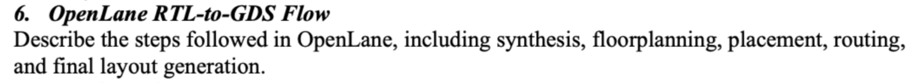

---

## image2.png

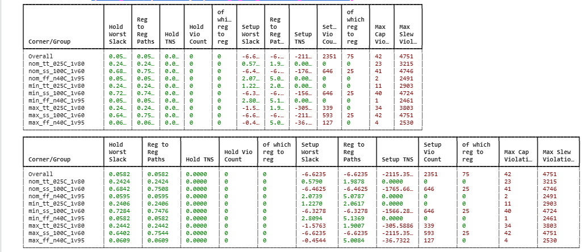

---

## image3.png

---

## image4.png

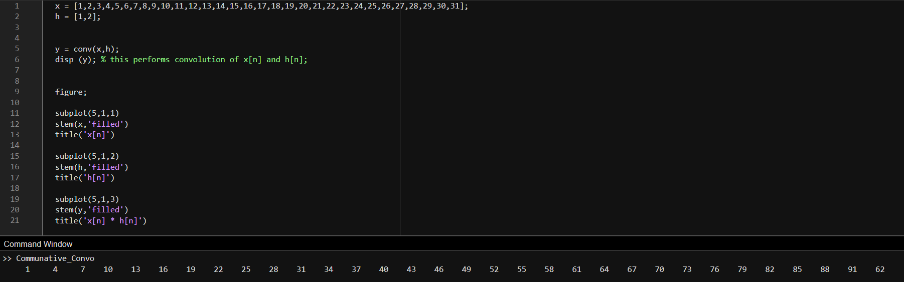

---

## image5.png

---

## image6.png

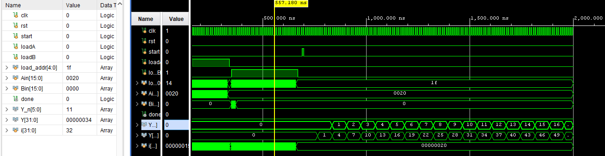

---

## image7.png

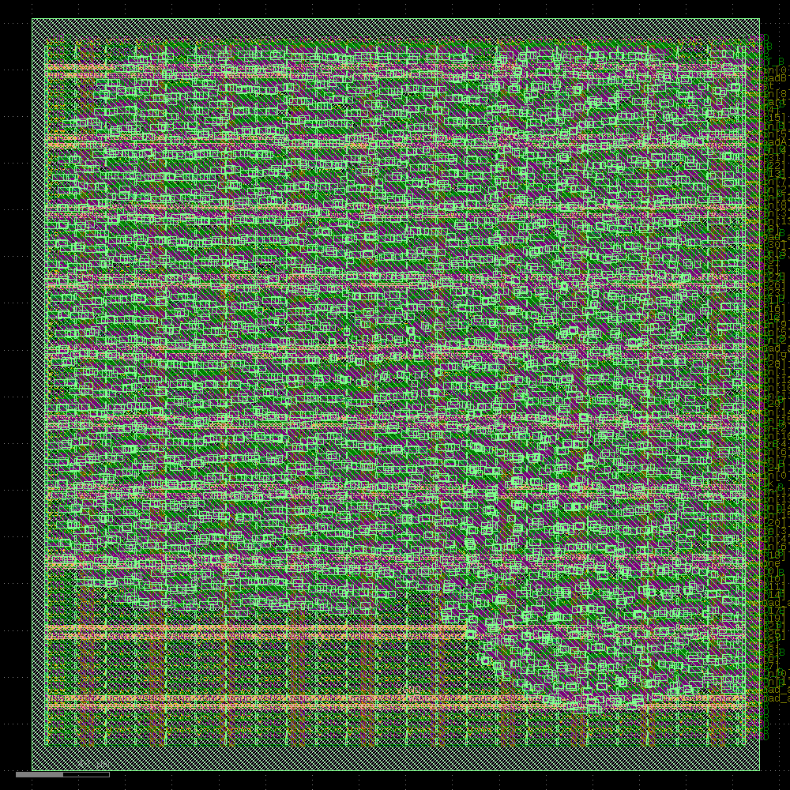

---

## image8.png

---

## image9.png

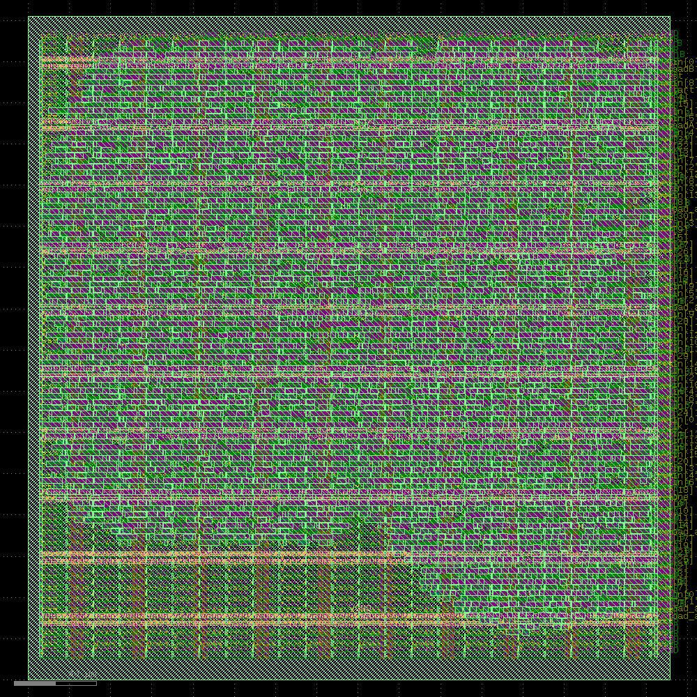

---

## image10.png

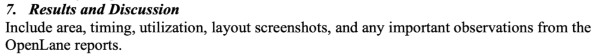

---

## image11.png

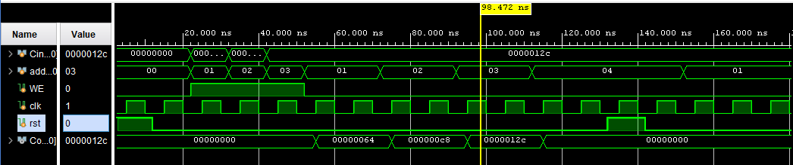

---

## image12.png

---

## image13.png

---

## image14.png

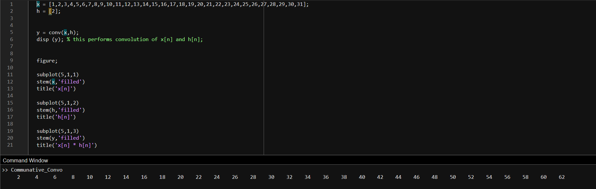

---

## image15.png

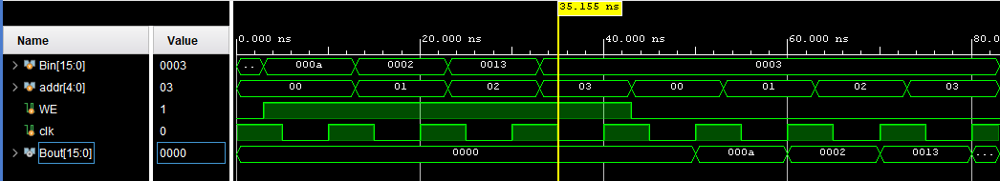

---

## image16.png

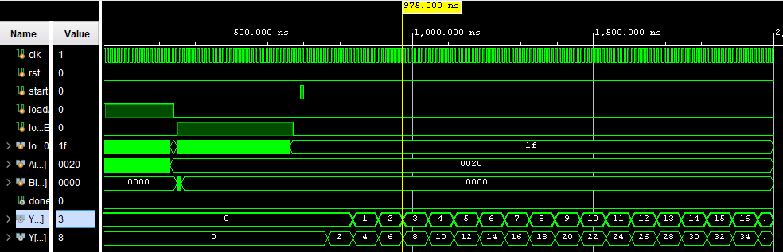

---

## image17.png

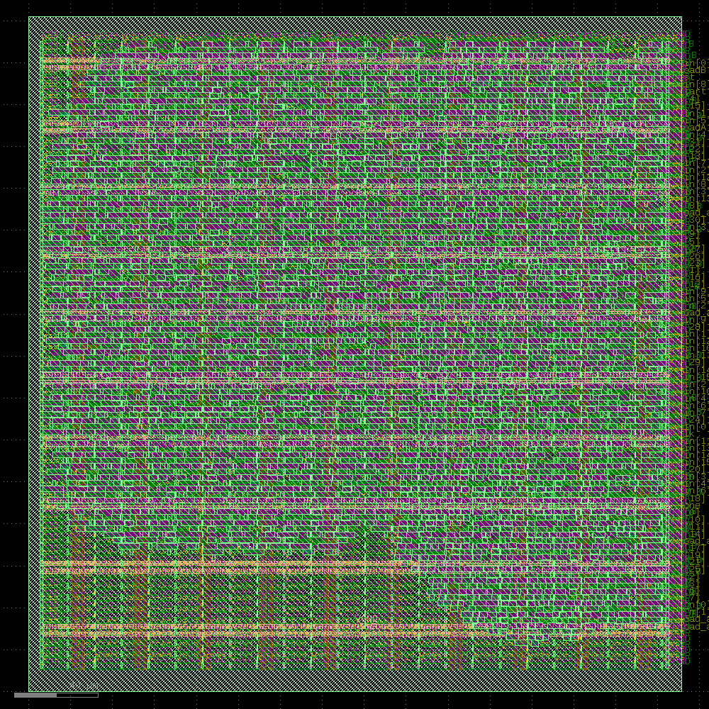

---

## image18.png

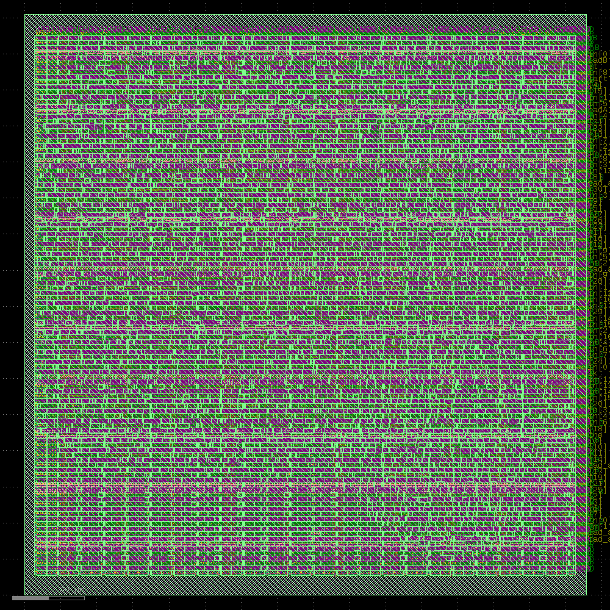

---

## image19.png

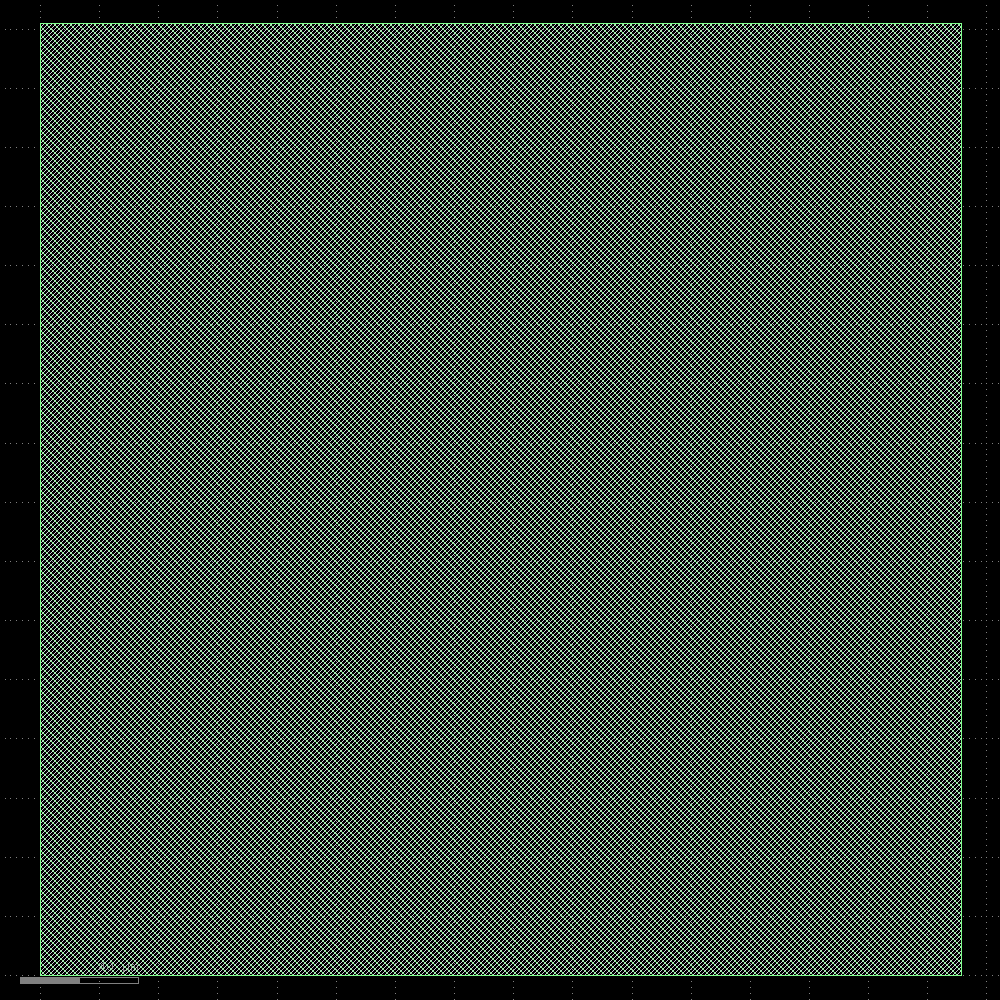

---

## image20.png

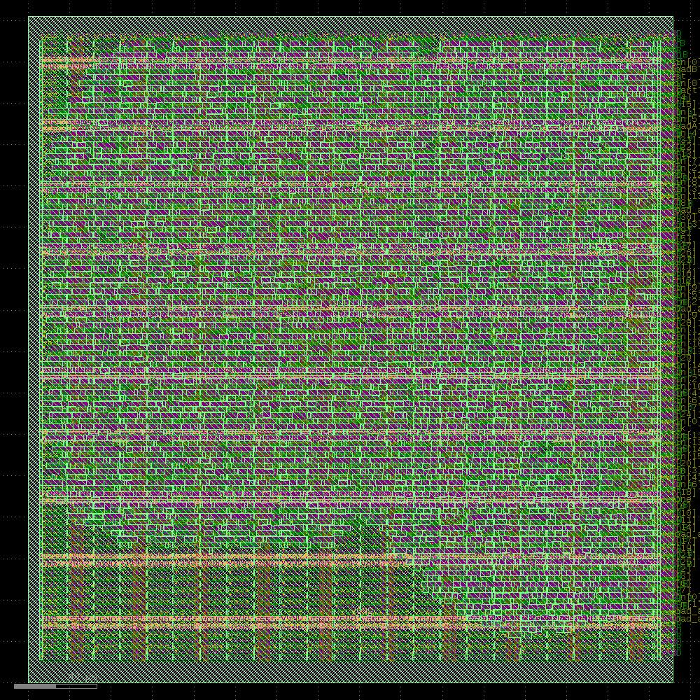
